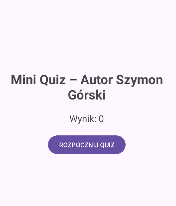
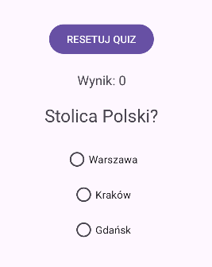
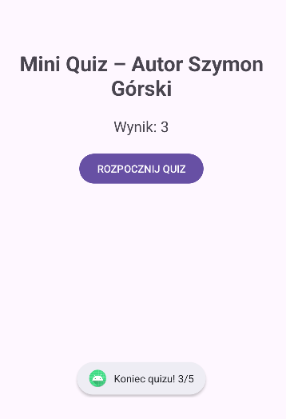

# Mini Quiz App

## Opis projektu
Mini Quiz to aplikacja mobilna w Android Studio (Java), w której użytkownik odpowiada na 5 losowo wybranych pytań jednokrotnego wyboru.

---

## Działanie aplikacji

Po uruchomieniu aplikacji użytkownik widzi ekran startowy z przyciskiem **„Start”**.

Po kliknięciu:
- aplikacja przechodzi do ekranu quizu,
- zostaje wylosowanych 5 pytań z puli dostępnych pytań,
- pierwsze pytanie wyświetla się automatycznie.

---

## Przebieg quizu

Na ekranie pytania:
- widoczne jest jedno pytanie i 3 odpowiedzi (A, B, C),
- użytkownik wybiera jedną odpowiedź.

Po zaznaczeniu odpowiedzi:
- aplikacja sprawdza czy odpowiedź jest poprawna,
- jeśli tak → dodawany jest 1 punkt,
- wynik aktualizuje się na bieżąco,
- odpowiedzi zostają zablokowane,
- po chwili pojawia się kolejne pytanie.

---

## Zakończenie quizu

Po udzieleniu odpowiedzi na 5 pytań:
- quiz automatycznie się kończy,
- wyświetlany jest komunikat z wynikiem (np. 3/5),
- użytkownik wraca do ekranu głównego.

---

## Reset quizu
Przycisk RESET:
- zeruje wynik,
- resetuje pytania,
- umożliwia ponowne rozpoczęcie quizu.

---

## Zrzuty ekranu

### Ekran startowy

### Pytanie w quizie

### Wynik końcowy

